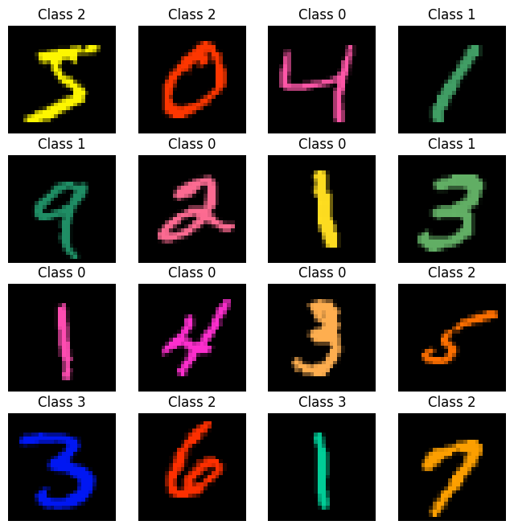

# Exercise 8: Explainable AI and Knowledge Extraction

## Overview
The goal of this exercise is to learn how to probe what a pre-trained classifier has learned about the data it was trained on. 

We will be working with a simple example which is a fun derivation on the MNIST dataset that you will have seen in previous exercises in this course. 
Unlike regular MNIST, our dataset is classified not by number, but by color! The question is... which colors fall within which class?



In this exercise, we will return to conventional, gradient-based attribution methods to see what they can tell us about what the classifier knows. 
We will see that, even for such a simple problem, there is some information that these methods do not give us. 

We will then train a generative adversarial network, or GAN, to try to create counterfactual images. 
These images are modifications of the originals, which are able to fool the classifier into thinking they come from a different class!. 
We will evaluate this GAN using our classifier; Is it really able to change an image's class in a meaningful way? 

Finally, we will combine the two methods — attribution and counterfactual — to get a full explanation of what exactly it is that the classifier is doing. We will likely learn whether it can teach us anything, and whether we should trust it!

## Setup

Before anything else, in the super-repository called `DL-MBL-2024`:
```
git pull
git submodule update --init 08_knowledge_extraction
```

Then, if you have any other exercises still running, please save your progress and shut down those kernels.
This is a GPU-hungry exercise so you're going to need all the GPU memory you can get.

Next, run the setup script. It might take a few minutes.
```
cd 08_knowledge_extraction
bash setup.sh
```
This will:
- Create a `conda` environment for this exercise
- Download the data and train the classifier we're learning about
Feel free to have a look at the `setup.sh` script to see the details.


Next, open the exercise notebook!

### Acknowledgments

This notebook was written by Diane Adjavon, from a previous version written by Jan Funke and modified by Tri Nguyen, using code from Nils Eckstein.